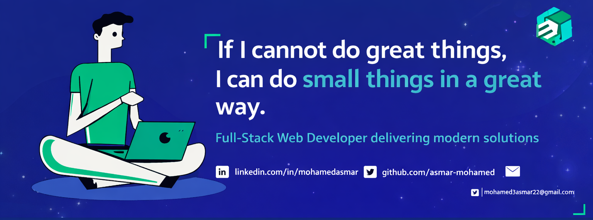

<h1 align="center">Hello

 I'm Mohamed ASMAR
</h1>

  

 

## 👨🏻‍💻 About Me:

- 🙋‍♂️ All about me is at **[My Portfolio](https://asmar-mohamed.vercel.app/)**  
- 🎓 Bachelor’s Student in **Ingénierie des Systèmes Informatiques et Technologies Web (ISITW)**  
- 💻 Full-Stack Web Developer (Laravel & React)  
- 🌱 Currently learning `Advanced Backend & Cloud`  
- 👯 Looking to collaborate on `Web & API Projects`  
- 💬 Ask me about `Laravel, React, MySQL`  
- 👨‍💻 Life Hack: Write clean code & keep learning 🚀  
- ⚡ Fun fact: I love football & e-sport ⚽🎮  

---

## 🛠️ Technologies and Tools I use:

---

## ❤️ Let's get connected:

---

## 📊 My GitHub Data:

  
  

